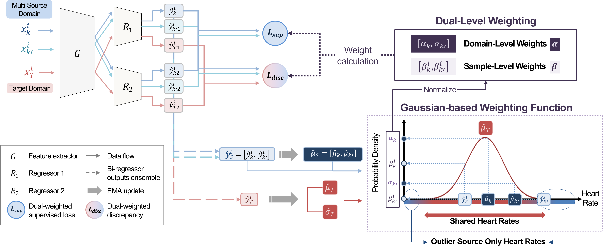

# GAUL
This is the official code of paper **Multi-Source Partial Domain Adaptation with Gaussian-based Dual-Level Weighting for PPG-based Heart Rate Estimation** based on PyTorch.  



## Installation
```bash
# pip
pip install -r requirements.txt

# conda
conda install --file requirements.txt
```

## Data
### PPG DaLiA
- We provide shell script which downloads the dataset DaLiA from their original hosts. Run the following line in your terminal:
```bash
sh get_data.sh
```
### IEEE SPC Train and Test
- Support for the IEEE datasets is implemented, but the original data format seems to be no longer available. You can download it in the new format under https://zenodo.org/record/3902710#.ZGM9l3ZBy3C and Data/preprocess the files or implement your own file reader.

## Training and Inference
Run the following in your terminal:
```bash
python main.py \
    --data Dalia
    --checkpoint-root "./Results/"
    --lr 1e-3
    --optimizer adam
    --epochs-G 2
    --mu 1e-3
    --ema-beta .99
```
This will run Leave-One-Out Cross-Validation on the DaLiA dataset.  
We highly recommend that [`Weights & Biases`](https://kr.wandb.ai/) to monitor model training. Make sure to log into `Wandb` in the console and then simply add the argument `--enable-wandb` to save additional plots and logging information.

## Contact
Please email to jihyun_k@korea.ac.kr should you have any questions, comments or suggestions.